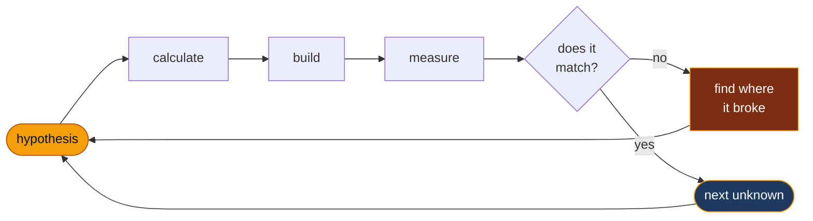

 

---

## 👋 About

**I want to build an AGI humanoid.** That is the whole goal. Everything on this profile is one
subsystem of it.

Right now I'm building **the hand** — because a general-purpose body is worth very little without a
general-purpose end effector, and because the hand is where the hard problems concentrate: eleven
joints, tendon routing, and contact you cannot fake in simulation.

Two months in I had a tendon-driven hand assembled — then swapped out the actuator the BOM called
for, which meant redesigning the power rail and re-deriving a good deal of what was never published.
Most of my work is that loop: **make a number, build the thing, then find out where the number was
wrong.**

Self-taught, working through the stack one subsystem at a time.

 

## 🔧 Currently Building — ORCA Hand Lite

> A tendon-driven robotic hand. The Lite variant is only partially open-sourced, so assembly, tendon
> routing, servo wiring, bus configuration and calibration all had to be reconstructed from the CAD.
> Built together with two other engineers I met in the ORCA Hand Discord.

**⚡ Actuator & power redesign**

Replaced the BOM's Feetech STS3215 with a different servo, which meant the electrical side had to be
redone rather than adapted.

- 12 V → **5 V rail redesigned** from scratch
- Multi-channel supply re-sized against **1.47 A stall per axis**
- Fingertip force estimated from stall and rated torque, spool radius and joint moment arm

**Predicted bottleneck: not torque — heat at stall-hold.** A hand spends its life gripping near
stall, so the limit is thermal rather than mechanical. Instrumenting current and temperature to
confirm.

**🔩 Reconstructed from the CAD**

Nothing about the Lite build order was published. Assembly sequence, tendon routing, servo wiring,
bus configuration and calibration each had to be inferred from the geometry, checked against the
official kinematics, and then written up so the two people building alongside me were not solving it
a second time.

Everything gets derived from the model and verified against it — exact solid classification on the
CAD rather than mesh approximation, watertightness checks on every generated part, and a full
right-hand physics model to confirm travel before anything is printed.

**❓ Still unmeasured — needs real hardware:** joint friction, and how far the servos drift once they
have been holding a grip for a while. Neither shows up in simulation; both decide whether the hand
is usable.

 

## 🛣️ Up next — Sim-to-Real with Isaac Sim

The hand already runs in MuJoCo. The next step is **NVIDIA Isaac Sim / Isaac Lab**: train grasping
policies in simulation and close the loop on the physical hand.

The parts I expect to be hard are exactly the ones I have not measured yet:

- **Tendon friction and hysteresis** — the sim assumes an ideal return. The real hand loses travel every cycle to friction, and that loss has to be identified on hardware and fed back into the model.
- **Thermal drift at stall-hold** — a policy trained on a servo that never heats up will not survive a hand that grips for thirty seconds.
- **Actuator model fidelity** — current-based position control does not behave like an idealised torque source.

Same loop as everything else here: **model it, run it, then measure where the model was wrong.**

 

## 📐 How I work

- **Numbers before parts.** Stall current, moment arms and stress ratios get computed before anything is ordered.
- **Derive, don't assume.** Joint mapping, routing paths and clearances all came out of the CAD geometry rather than a guess.
- **Write down what is still wrong.** Everything I publish carries a "not yet verified" section, and revisions say why they happened.

 

## 🧰 Toolbox

<picture>
  <source media="(prefers-color-scheme: dark)" srcset="https://skillicons.dev/icons?i=python,ros,ubuntu,raspberrypi,blender,git,linux,bash&theme=dark"/>
  
</picture>

  

**Robotics & Control**

**Simulation & Sim-to-Real**

**CAD & Fabrication**

**Certified & hands-on**

 

## 📫 Reach me

  

<em>Short on credentials. Long on iterations. Building toward a humanoid, one measured subsystem at a time.</em>

